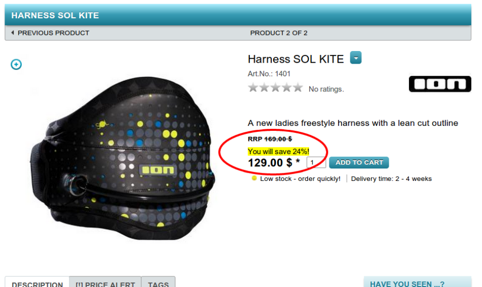

mysaving
========

Display “You will save x %” on the product details page in OXID eShop

This is a plug-and-play working module for displaying the saving in percent if you entered a real price and the recommended retail price (RRP) in your OXID eShop. 
The module was developed on the basis of OXID eShop version 4.7.3 and is an example for how to write modules for OXID eShop version 4.7 and above.

Please find the article with detailed explanations on my personal blog: 
http://www.marco-steinhaeuser.de/how-to-write-a-module-for-oxid-eshop-display-you-will-save-x-on-the-product-details-page.html

###License:

According to the GPLv3 FAQ, this module is published under GPLv3 as well and can be used with any edition of OXID eShop (CE, PE & EE): 
http://www.oxid-esales.com/de/community/oxid-eshop-herunterladen/oxid-esales-gpl-v3-faq.html

###Installation:

* download the zip file and unzip it
* copy the folder /mst/ to the /modules/-directory of your OXID eShop installation
* fire up the admin panel of your OXID eShop, go to extensions -> modules, mark the module "mysaving" and activate it
* you're done, enjoy :-)
